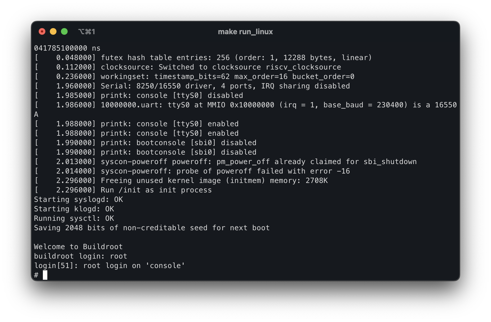

# RV64GC Emulator Software Suite

This repository houses the software and associated assets for the [RV64GC Emulator](https://github.com/bane9/rv64gc-emu), a RISC-V emulator developed in C++20.

Contained within this repository are the Linux buildroot configuration and a port of DOOM, both compatible with the RV64GC Emulator.

## Table of Contents
- [Setup](#setup)
- [Building Linux](#building-linux)
- [DOOM Port](#doom-port)
- [Dependencies and Credits](#dependencies-and-credits)
- [License](#license)

## Setup

Initially, compile the emulator by adhering to the instructions available in [the Emulator's git directory](https://github.com/bane9/rv64gc-emu). Once the build is complete, copy the executable (located in the build/rv64gc_emu) to the root of this git repository.

## Building Linux



To build the Linux kernel and OpenSBI bootloader for this emulator, first install the dependencies (Linux only):

```bash
sudo apt install -y git build-essential wget cpio unzip rsync bc libncurses5-dev screen bison file flex 
```

After that, execute the build with:
```bash
make linux
```

Then, run it via the following command:
```bash
cd output/
./run_linux.sh
```

When the emulator is compiled using the Native CLI flag, it results in faster load times for Linux.

Currenly, the kernel gets stuck during initalization at `Freeing unused kernel image (initmem) memory`. The kernel itself is not frozen, but it's unclear why it doesn't schedule init as of now.

## DOOM Port


In order to build the DOOM port, place a .wad file in the root of this git repository. For the baremetal build, execute the following command: 
```bash
make doom_baremetal
```

Next, to run the port, use the following command: 
```bash
cd output/
./doom_baremetal.sh
```

Please note that this will not work if the emulator was compiled with the Native CLI flag.

## Dependencies and Credits

- [MesloLGS NF Regular font](https://github.com/romkatv/dotfiles-public/blob/master/.local/share/fonts/NerdFonts/MesloLGS%20NF%20Regular.ttf) - included as font.ttf in the `misc` folder
- [doomgeneric](https://github.com/ozkl/doomgeneric) - used as a DOOM port
- [buildroot](https://buildroot.org/) - used for the Linux build environment

## License

This repository is licensed under the GNU GPLv3.

The RISC-V trade name is a registered trademark of RISC-V International.

The DOOM name and logo are trademarks or registered trademarks of id Software LLC.
